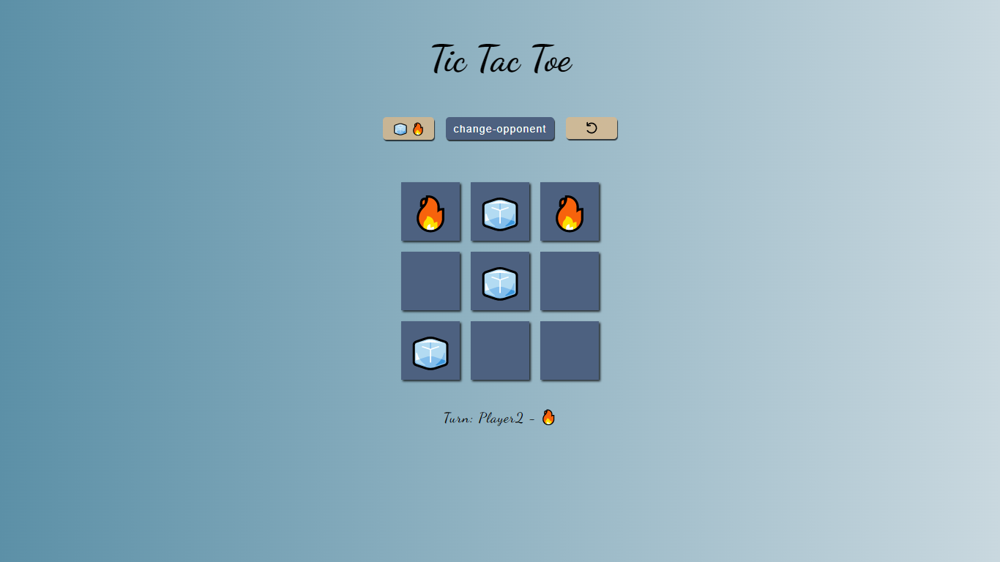

# Tic-Tac-Toe
Task from [The Odin Project](https://www.theodinproject.com/lessons/node-path-javascript-tic-tac-toe#assignment)

The lesson focuses on Factory Functions and The Module Pattern where
the goal is to have as little global code as possible. Applied concepts that
are relatively new to me are:

Factory Function - Requires calling the function to setup new object. Doesn't require 'new' keyword. 
IIFE - creates private scope for functions and variables. 
Module Pattern - design pattern that wraps in IIFE. Used for singleton style objects.

The project explains encapsulating the code, in summary.

